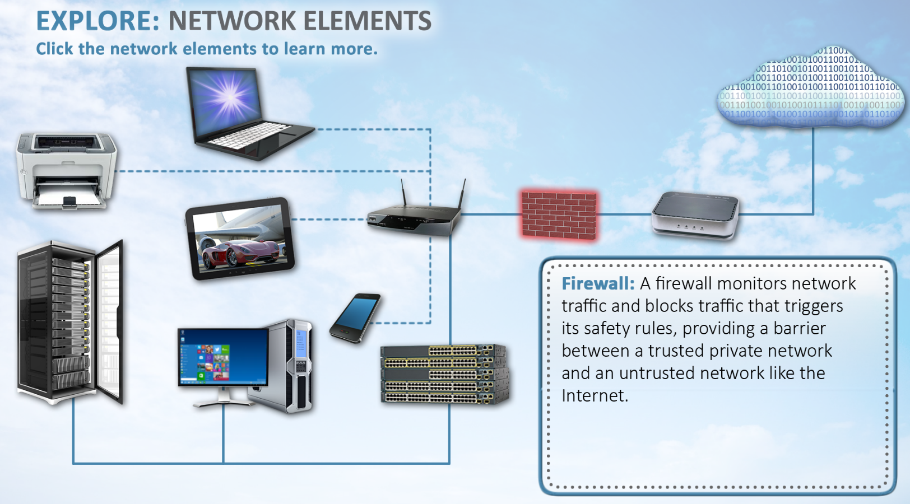

# Section 1: Introduction to Networking Conceptions

## Lesson 1.1: Network History

Watch this [Intro to networks](https://www.youtube.com/watch?v=WO6P92v61y4) crash course.

### Video Notes

---

Watchi this video [Computer Network Types (needs edu access)](https://wgu.percipio.com/videos/b39f2704-a8c9-408d-80dc-0cbfbaed9737)

### Video Notes

* Local Area Network (LAN)
    + benefits
        - quick communication
        - reliable and fast transmission
        - resource sharing
* Wide Area Network (WAN)
    + coverage
    + performance
        - longer distances/slower
    + requires more robust security measures
    + typically has encryption/VPN
* Metropolitan Area Network (MAN)
    + can span an entire city or town
    + uses IEEE 802.11 networking standards for better performance and increased bandwidth
    + fiber is commonly used for connectivity
    + balances WAN and LAN
* Personal Area Network (PAN)
    + portability
    + affordability
    + reliabillity
    + security
* Content Delivery Network (CDN)
    * strategically placed in particular locations all over the world
        + reduced latency to users
    * often include security features
        + protects users
            + from DDoS
            + traffic spikes
            + filter and blocks malicious traffic
    * site performance

* Virtual Private Network (VPN)
    + enhance privacy
        - masks real location (appears as if you're accessing the Internet from a different location)
        - Geo-spoofing
    + enhanced security
        - typically use encryption protocols

* Storage Area Network (SAN)
    + specialized high speed network that provides network acces to storage devices
    + composed of various technologies, including hosts, switches, storage elements, and storage devices
    + used to improve application availability and performance and to increase utilization

---

Another video [History of Information Security (access required)](https://wgu.percipio.com/courses/41fc14cb-2fb0-4f23-aa20-684983abab61/videos/bc671b92-206e-434d-8696-50d34626982d?sharelink=4fVJP12iV)

Protect our data blah blah, IoT devices, constantly evolving story.

### Major Milestones over the past 50 years

Steady rise in technology v. Major modern-day issues. Here are the timelines:

#### 1950s and 1960s

* physical security was most predominant
    + security guards
    + locked doors
* information security did not really exist

#### 1970s
In the 1970s the shift toward information security began. 

* various potential threats and possible security measure identified
* ARPANET - The Advanced Research Projects Agency Network
* 1960s the first virus came out, Bob Thomas created it in 1969
    + replicated itself (called creeper)
* The guy who invented e-mail created reaper which sought it out lol

#### 1980s

* Networking 
* Viruses
* Hacking

#### 1990s

* Information Assurance (IA)
    + no longer waiting on after the fact
* Non-repudiation
    + data cannot be denied by sender or reciever
* firewalls
* authentication

#### 2000s

* Availability
* Integrity
* Confidentiality
* Accountability
* Assurance

These terms are important, if one is compromised, so are the others

* Government cracks down on cyber crimes
    + Jail time instead of fines
* Viruses evolve
    + nation-state attacks
* code red and nimda viruses
    + governments reacted by strengthing the punishments and laws surrounding cyber crimes

#### 2010s

A number of the largest data breaches in history

* e.g., Snowden and the NSA, 2013
    + cyber security required a more proactive approach

#### Infosec Today

* ransomware
* cryptojacking
* state-sponsered attacks
* phishing
* IoT attacks
* smart medical devices

### Section references

Clark, B. (2021, Aug.). Introduction to networking. [Video Course]. Percipio. 

Newell, B. (2023, Apr.). Information security for leaders: An introduction to InfoSec. [Video Course]. Percipio. 

---

## Lesson 1.2: Networking Components

Complete this activity: it's a silly infographic with some definitions of various network and IT hardware.

---

## Lesson 1.3: 

---

## Lesson 1.4: 

---

## Lesson 1.5: 

---

## Lesson 1.6: 

---

## Lesson 1.7: 

---

## Lesson 1.8: 

--

## Lesson 1.9: Types of Network Architecture 

---

[🔜 Next Section](./S3-LESSON2.md)

[🔙 Back to Main Page](../../README.md)
