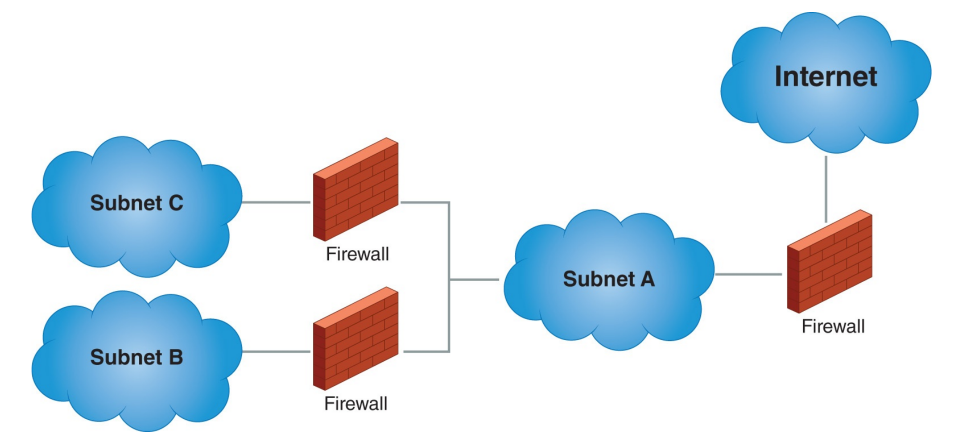

# Lesson 2: Securing a Network

## Lesson 2.1: Firewalls

* firewall controls the flow of traffic by preventing unauthorized traffic from entering or leaving a particular segment of a network.

## Lesson 2.1: IDS - IPS

## Lesson 2.3: Encryption Techniques and Methods

## Lesson 2.4: Common Encryption Uses

## Lesson 2.5: Device Hardware: Why and How

* Read pages 524–526 ("Network Device Hardening" in "Chapter 12: Network Operations and Management") in Fundamentals of Communications and Networking.

 The chapter covers critical topics:

* network eavesdropping
* denial of service attacks
* hardening of network devices
 
It emphasizes the importance of securing networks against various types of attacks:

* Watch "Security Hardening" (2:00) in "Systems Hardening" from Percipio.
* Read pages 594–596 ("Layered Network Security Architectures" in "Chapter 14: Network Security") in Fundamentals of Communications and Networking.

The chapter outlines the seven layers of this architecture:

* people security
* physical security
* perimeter security
* network security
* endpoint security
* application security
* data security.

* Watch "How Defense in Depth Works" (6:03) in "Mitigating Security Risks: Managing Information, Cloud, & Data Security Risks" from Percipio.
* Watch "Defense in Depth" (5:05) in "Microsoft Security: Compliance Concepts & Methodologies" from Percipio.

## Lesson 2.6: Mitigation of Cyberattacks

## Lesson 2.7: Security Threats

## Lesson 2.8: Response to Mitigation

---

[🔜 Next Section](./S3-LESSON3.md)

[🔙 Back a Section](./S3-LESSON1.md)

[🔙 Back to Main Page](../../README.md)

