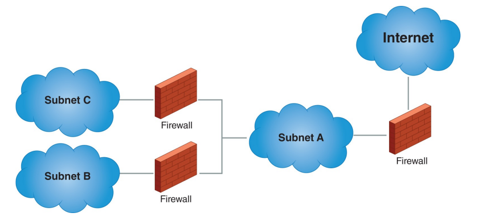

# Lesson 2: Securing a Network

## Lesson 2.1: Firewalls

* firewall controls the flow of traffic by preventing unauthorized traffic from entering or leaving a particular segment of a network.

## Lesson 2.1: IDS - IPS

## Lesson 2.3: Encryption Techniques and Methods

## Lesson 2.4: Common Encryption Uses

## Lesson 2.5: Device Hardware: Why and How

## Lesson 2.6: Mitigation of Cyberattacks

## Lesson 2.7: Security Threats

## Lesson 2.8: Response to Mitigation

---

[🔜 Next Section](./S3-LESSON3.md)

[🔙 Back a Section](./S3-LESSON1.md)

[🔙 Back to Main Page](../../README.md)

